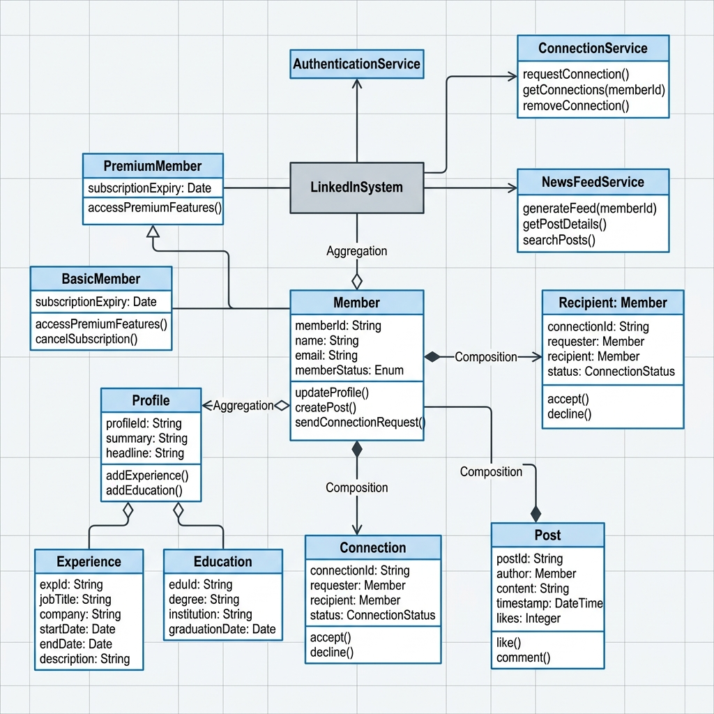
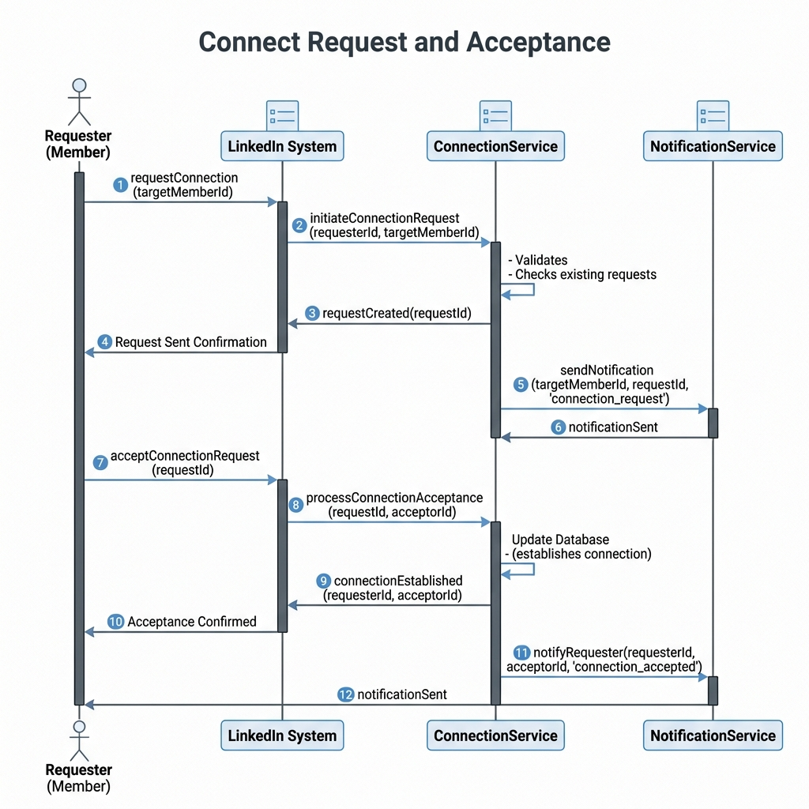
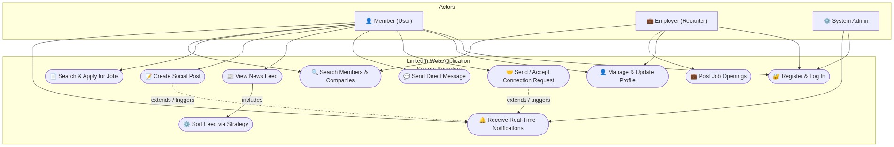
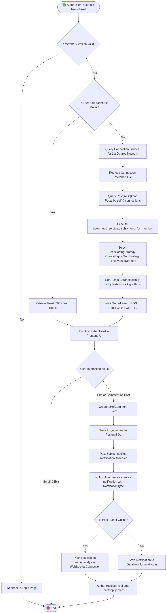
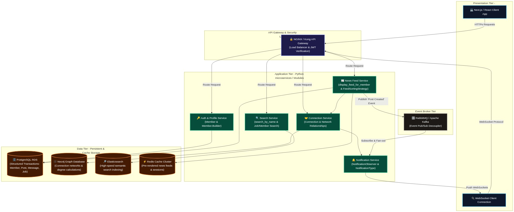
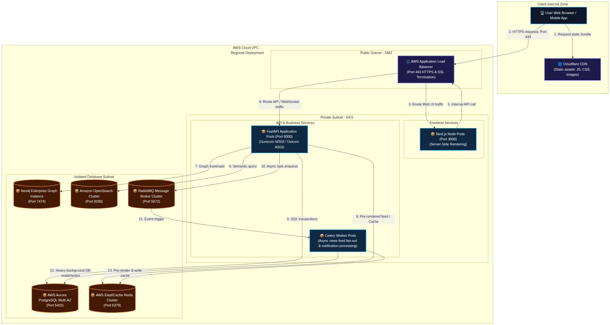

# Designing a Professional Networking Platform like LinkedIn

## Requirements
#### User Registration and Authentication:
- Users should be able to create an account with their professional information, such as name, email, and password.
- Users should be able to log in and log out of their accounts securely.
#### User Profiles:
- Each user should have a profile with their professional information, such as profile picture, headline, summary, experience, education, and skills.
- Users should be able to update their profile information.
#### Connections:
- Users should be able to send connection requests to other users.
- Users should be able to accept or decline connection requests.
- Users should be able to view their list of connections.
#### Messaging:
- Users should be able to send messages to their connections.
- Users should be able to view their inbox and sent messages.
#### Job Postings:
- Employers should be able to post job listings with details such as title, description, requirements, and location.
- Users should be able to view and apply for job postings.
#### Search Functionality:
- Users should be able to search for other users, companies, and job postings based on relevant criteria.
- Search results should be ranked based on relevance and user preferences.
#### Notifications:
- Users should receive notifications for events such as connection requests, messages, and job postings.
- Notifications should be delivered in real-time.
#### Scalability and Performance:
- The system should be designed to handle a large number of concurrent users and high traffic load.
- The system should be scalable and efficient in terms of resource utilization.


## Classes, Interfaces and Enumerations
1. The **User** class represents a user in the LinkedIn system, containing properties such as ID, name, email, password, profile, connections, inbox, and sent messages.
2. The **Profile** class represents a user's profile, containing properties such as profile picture, headline, summary, experiences, educations, and skills.
3. The **Experience**, **Education**, and **Skill** classes represent different components of a user's profile.
4. The **Connection** class represents a connection between two users, containing the user and the connection date.
5. The **Message** class represents a message sent between users, containing properties such as ID, sender, receiver, content, and timestamp.
6. The **JobPosting** class represents a job listing posted by an employer, containing properties such as ID, title, description, requirements, location, and post date.
7. The **Notification** class represents a notification generated for a user, containing properties such as ID, user, notification type, content, and timestamp.
8. The **NotificationType** enum defines the different types of notifications, such as connection request, message, and job posting.
9. The **LinkedInService** class is the main class that manages the LinkedIn system. It follows the Singleton pattern to ensure only one instance of the service exists.
10. The **LinkedInService** class provides methods for user registration, login, profile updates, connection requests, job postings, user and job search, messaging, and notifications.
11. Multi-threading is achieved using concurrent data structures such as ConcurrentHashMap and CopyOnWriteArrayList to handle concurrent access to shared resources.
12. The **LinkedInDemo** class demonstrates the usage of the LinkedIn system by registering users, logging in, updating profiles, sending connection requests, posting job listings, searching for users and jobs, sending messages, and retrieving notifications.

---

## System Architecture

The system is organized into a clean, layered architecture with modular separation of concerns. This structure conforms to modern clean code standards, separating entities (models), business logic (services), extensibility strategies, event observers, and platform core orchestration.

```
linkedin/
│
├── app/
│   ├── models/       # Pure domain objects and entity builders
│   ├── services/     # Pure business logic services (connections, newsfeeds, etc.)
│   ├── strategies/   # Extensible behavioral strategies (feed sorting)
│   ├── observers/    # Event-driven pub-sub classes (real-time notification delivery)
│   ├── core/         # Configuration, enums, and system orchestrators
│   └── demo/         # Sandbox scenario demonstrating end-to-end execution
│
└── docs/             # Diagrams and architectural guides
```

Refer to the full architecture document here: [docs/architecture.md](docs/architecture.md)

---

## Design Patterns Implemented

The LinkedIn Platform leverages several foundational Design Patterns to enforce loose coupling, high cohesion, and single responsibility principles.

### A. Singleton Pattern
* **Location**: `app/core/linkedin_system.py`
* **Implementation**: Uses a thread-safe double-checked locking mechanism (`threading.Lock`) within the `__new__` method to guarantee that exactly one instance of the `LinkedInSystem` is created and shared across the application.
* **Purpose**: Coordinates access to the central in-memory database of registered members, connections, search indexes, and active services.

### B. Builder Pattern
* **Location**: `app/models/member.py`
* **Implementation**: The nested `Member.Builder` class provides a step-by-step fluid API to configure and construct complex `Member` objects:
  ```python
  alice = Member.Builder("Alice", "alice@example.com") \
      .with_summary("Senior Software Engineer...") \
      .add_experience(Experience(...)) \
      .add_education(Education(...)) \
      .build()
  ```
* **Purpose**: Decouples the representation and initialization process of a multi-faceted profile representation from the Member instance class itself.

### C. Observer Pattern
* **Location**: `app/observers/notification_observer.py`, `app/models/post.py`
* **Implementation**: The standard subject-observer structure allows a `Post` (inheriting from `Subject`) to notify registered `NotificationObserver` instances (e.g. the post `author`) when events like likes and comments occur.
* **Purpose**: Enables decoupled, real-time reactive notifications when interactive engagement is recorded on shared posts.

### D. Strategy Pattern
* **Location**: `app/strategies/feed_sorting_strategy.py`
* **Implementation**: Exposes an abstract base interface `FeedSortingStrategy` requiring a `sort(posts)` method, concretely implemented by `ChronologicalSortStrategy`.
* **Purpose**: Allows the system to dynamically plug in alternative ranking, relevance, or filtering algorithms for a member's news feed at runtime without modifying the news feed core.

---

## Visual UML Diagrams

### UML Class Diagram


### UML Sequence Diagram


### UML Use Case Diagram


### UML Activity Diagram (News Feed & Notification Flow)


### UML Component Diagram (System Modules & Database Topology)


### UML Deployment Diagram (AWS Infrastructure Topology)
